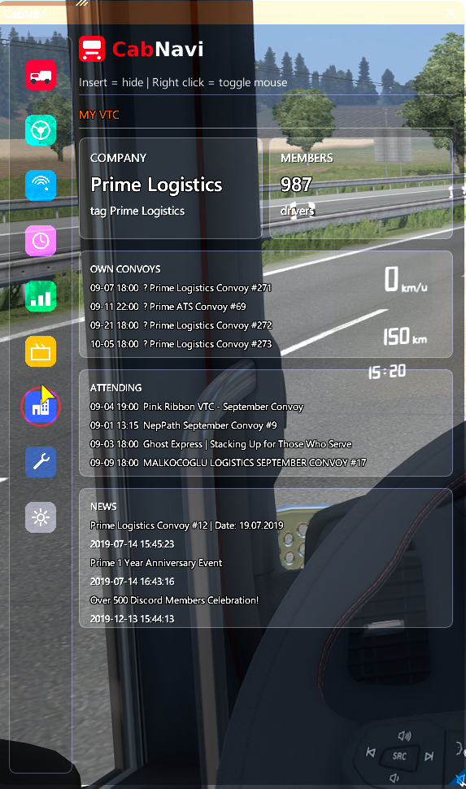

<p align="center">
  
</p>

<p align="center">
  An in-game HUD overlay and trip logbook for <b>TruckersMP</b> (Euro Truck Simulator 2)
</p>

---

CabNavi draws a clean, resizable panel on top of the game with everything a
driver keeps an eye on: live speed and fuel, your own tachograph, damage,
nearby players on a radar, a full trip history, and your VTC's convoys. It
records every job you finish so you can look back at what you drove, what it
cost, and how you are doing over time.

> **Not affiliated with SCS Software or TruckersMP.** CabNavi is an
> unofficial third-party plugin. All trademarks are the property of their
> respective owners.

---

## Screenshots

| Live &mdash; freight | Live &mdash; bus | Dashboard |
|---|---|---|
|  |  |  |

| Players | Trip log | Statistics |
|---|---|---|
|  |  |  |

| VTC | VTC settings | Settings |
|---|---|---|
|  |  |  |

| Settings (continued) |
|---|
|  |

---

## Features

**On the road**
- Live speed with the current limit, fuel level, cruise control and range
- Fuel consumption in km/l, switching to l/hour when you are standing still
- Your own tachograph: follow the game, your own rules, or EU driving times
- Damage for truck, trailer and cargo at a glance
- Efficiency line: how this trip compares to your own average

**Around you**
- Radar with nearby players, real bearing and heading from vehicle positions
- Role colours for staff, patrons and members of your own VTC
- Long combinations marked separately
- Distance and ping per player

**Your trips**
- Every freight job and bus line logged automatically
- Distance, income, fuel used, fuel cost, damage and delays
- Estimated arrival time in real time, not game time
- Incident recorder: freezes the last few minutes of player data when you
  take damage, so you can see who was around
- Optional Discord message when a trip finishes

**VTC integration** (optional)
- Your company, member count, own convoys and the events it attends
- Company news
- Highlight fellow members on the radar and in the player list
- Convoy reminder on the Live tab when one starts within the hour
- Your own schedule for the coming month

**Other**
- Dutch and English, switchable in the settings
- Your own logo in the header
- Everything can be turned off; nothing contacts the internet unless you
  enable it

---

## Installation

1. Download the latest release from the [Releases](../../releases) page.
2. Unpack the ZIP to a folder.
3. Run **install.bat**. It locates your game, installs the plugin and puts
   the icons and default logo in place. If it cannot find the game it will
   ask you for the folder.
4. Start the game through TruckersMP. Press **Insert** to show or hide the
   overlay, and **right click** to toggle the mouse.

<details>
<summary>Rather do it by hand?</summary>

| From the ZIP | Goes to |
|---|---|
| `cabnavi.dll` | `<game folder>\bin\win_x64\plugins\` |
| `icons` folder | `%APPDATA%\CabNavi\icons\` |
| `logo.png` | `%APPDATA%\CabNavi\logo.png` |

Create the `plugins` folder if it does not exist. Only the DLL is required:
without the icons the overlay draws simple ones itself, and without a logo it
just shows its name.

</details>

### Your own logo

Put a file called `logo.png` in `%APPDATA%\CabNavi\`.

- **PNG only**, with a transparent background
- Drawn at **32 pixels high**; width follows automatically
- Around **64 pixels high** is ideal, so it stays sharp
- Keep it under roughly 320 pixels wide, or it pushes the header around

No logo file means CabNavi simply shows its name as text.

### Where your data lives

Everything is stored in `%APPDATA%\CabNavi\`:

| File | What it holds |
|---|---|
| `trips.jsonl` | your trip log |
| `uiterlijk.json` | colours, opacity, language |
| `instellingen.json` | fuel price and Discord webhook |
| `tachograaf.json` | tachograph state |
| `vtc.json` | VTC settings and convoys you ticked |
| `spelers_vtc.json` | cached player VTC lookups |
| `debug.log` | diagnostics, cleared on every start |

---

## Building from source

You only need this if you want to compile CabNavi yourself. Users of the
release do not need any SDK.

**Requirements**

- Windows, Visual Studio 2022 (Desktop C++ workload)
- CMake 3.20 or newer
- [TruckersMP GameClientSDK](https://github.com/TruckersMP/GameClientSDK)
- [SCS Telemetry SDK](https://modding.scssoft.com/wiki/Documentation/Engine/SDK/Telemetry)

Dear ImGui, nlohmann/json and stb_image are fetched automatically by CMake.

**Configure and build**

```bat
cmake -B build -A x64 ^
      -DTMP_SDK_DIR="C:\path\to\GameClientSDK\include" ^
      -DSCS_SDK_DIR="C:\path\to\scs_sdk\include"

cmake --build build --config Release
```

The result is `build\Release\cabnavi.dll`.

**Quick type check without Windows**

`tools/compileertest/check.sh` type-checks every source file on Linux using
stub headers. It does not link, so it is no substitute for the real build,
but it catches typos and missing definitions in seconds:

```bash
bash tools/compileertest/check.sh /path/to/GameClientSDK/include
```

---

## Project layout

```
src/                  source code
icons/                tab icons (PNG, 128x128)
dashboard/            standalone offline dashboard for your trip history
tools/compileertest/  type check with stub headers
CMakeLists.txt
```

---

## Data sources

CabNavi combines two sources, both already present in your game:

| What | Source |
|---|---|
| Speed, fuel, damage, odometer, cargo | SCS Telemetry SDK |
| Nearby players, bus lines, rendering | TruckersMP Client SDK |
| Server status, events, VTC data | TruckersMP Web API |

The Web API is only contacted when you switch it on, and requests are
deliberately kept slow and cached: this is community infrastructure, not
ours.

---

## Known limits

These are not bugs; the data simply is not available:

- **No live consumption channel.** The game does not export it, so
  consumption is derived from the fuel level over time. Every other HUD
  faces the same limit.
- **No country channel.** Fuel prices per country are set by hand.
- **`game.next.rest.stop` no longer exists** in ETS2 1.60, so the mandatory
  break is counted by CabNavi itself.
- **Your own event sign-ups cannot be read** from the Web API, so you tick
  convoys yourself under Statistics.

---

## Contributing

Issues and pull requests are welcome. 
The interface is available in both Dutch and English.

## ⚖️ Legal disclaimer

This project is an unofficial, community-made overlay and third-party tool.
It is built on publicly available data from the **SCS Telemetry SDK**, the
**TruckersMP Client SDK** and the **public TruckersMP Web API**.

**No affiliation.** This project is not affiliated with, endorsed by,
sponsored by, or connected in any way with SCS Software or TruckersMP.

**Trademarks.** "Euro Truck Simulator 2", "SCS Software" and "TruckersMP",
including all associated logos, names and images, are the exclusive property
and trademarks of their respective owners. They are used here only to
describe what this plugin works with.

**No advantage.** CabNavi does not modify the game, does not change how you
appear to other players, and gives no advantage in traffic or in jobs. It
only shows information the game already provides to you.

**Use at your own risk.** This software is provided "as is", without any
warranty. It is meant for loyal ETS2 and TruckersMP players. If you tamper
with the software yourself and that causes technical problems, or if you
modify it and end up banned on TruckersMP, that is on you and not on the
developer. Always follow the official TruckersMP rules, and drive by them
too. See sections 15 and 16 of the GPL-3.0 for the full legal wording.

**If something breaks.** Plugins run inside the game process. If the game
starts behaving oddly, remove `cabnavi.dll` from the plugins folder and check
whether the problem goes away before reporting it elsewhere.

**Your data stays yours.** Nothing is uploaded anywhere. Network requests go
to `api.truckersmp.com` only when you switch that on, and to a Discord
webhook only if you configure one yourself.

## License

GPL-3.0. See [LICENSE](LICENSE).
