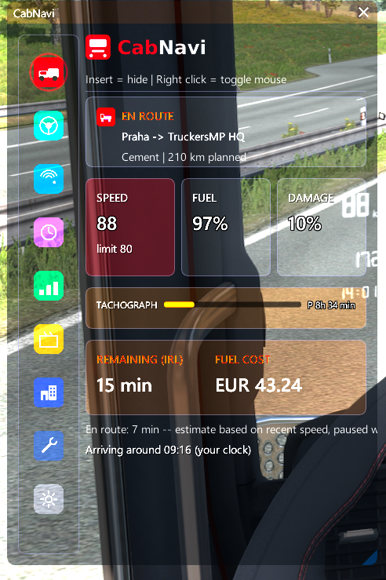
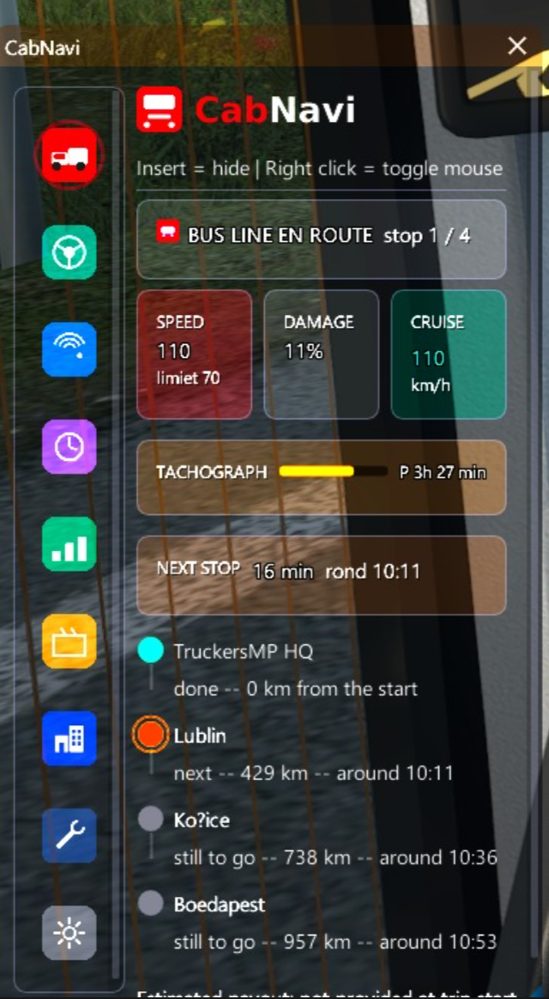
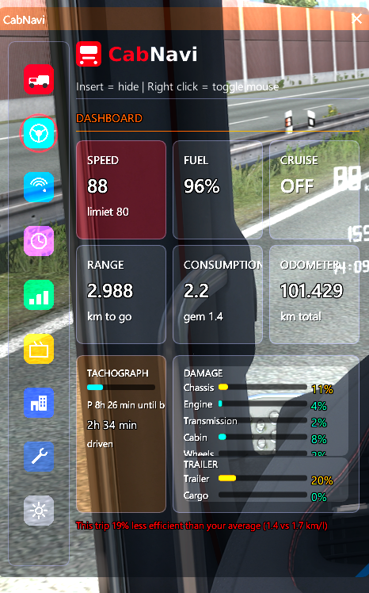
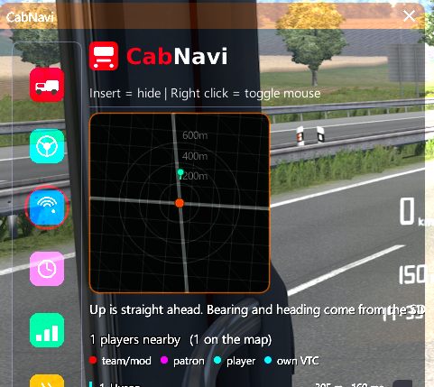
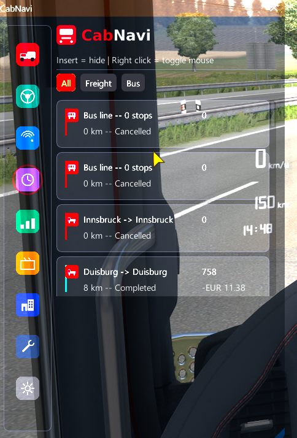
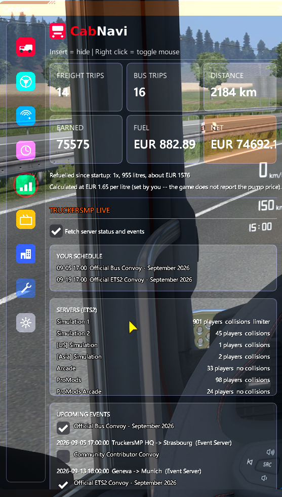
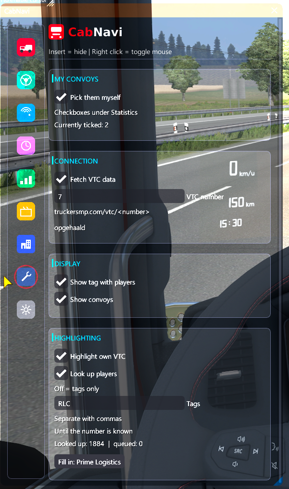
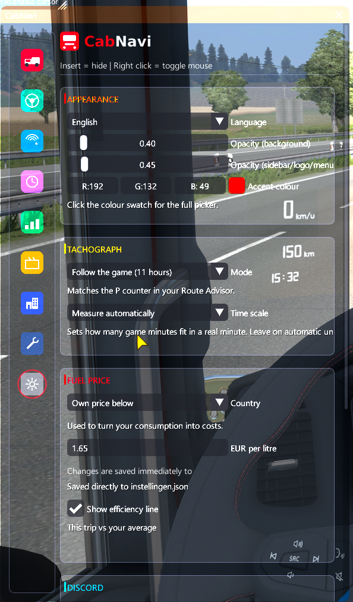
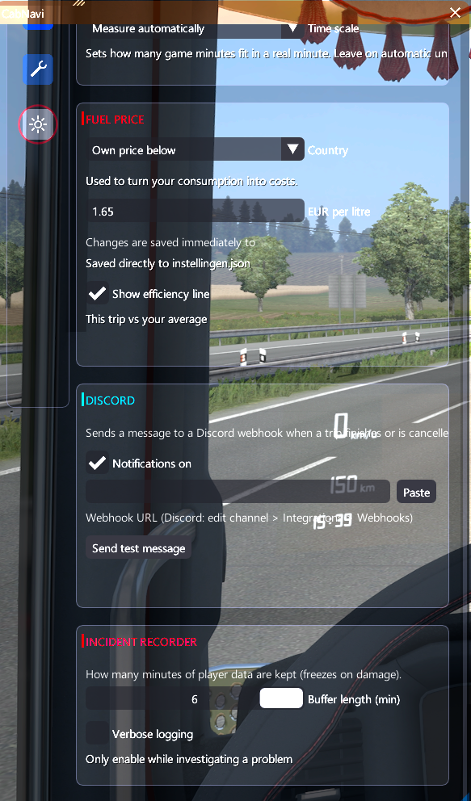

<p align="center">
  
</p>

<p align="center">
  An in-game HUD overlay and trip logbook for <b>TruckersMP</b> (Euro Truck Simulator 2)
</p>

---

CabNavi draws a clean, resizable panel on top of the game with everything a
driver keeps an eye on: live speed and fuel, your own tachograph, damage,
nearby players on a radar, a full trip history, and your VTC's convoys. It
records every job you finish so you can look back at what you drove, what it
cost, and how you are doing over time.

> **Not affiliated with SCS Software or TruckersMP.** CabNavi is an
> unofficial third-party plugin. All trademarks are the property of their
> respective owners.

---

## Screenshots

| Live &mdash; freight | Live &mdash; bus | Dashboard |
|---|---|---|
|  |  |  |

| Players | Trip log | Statistics |
|---|---|---|
|  |  |  |

| VTC settings | Settings | Settings (continued) |
|---|---|---|
|  |  |  |

---

## Features

**On the road**
- Live speed with the current limit, fuel level, cruise control and range
- Fuel consumption in km/l, switching to l/hour when you are standing still
- Your own tachograph: follow the game, your own rules, or EU driving times
- Damage for truck, trailer and cargo at a glance
- Efficiency line: how this trip compares to your own average

**Around you**
- Radar with nearby players, real bearing and heading from vehicle positions
- Role colours for staff, patrons and members of your own VTC
- Long combinations marked separately
- Distance and ping per player

**Your trips**
- Every freight job and bus line logged automatically
- Distance, income, fuel used, fuel cost, damage and delays
- Estimated arrival time in real time, not game time
- Incident recorder: freezes the last few minutes of player data when you
  take damage, so you can see who was around
- Optional Discord message when a trip finishes

**VTC integration** (optional)
- Your company, member count, own convoys and the events it attends
- Company news
- Highlight fellow members on the radar and in the player list
- Convoy reminder on the Live tab when one starts within the hour
- Your own schedule for the coming month

**Other**
- Dutch and English, switchable in the settings
- Your own logo in the header
- Everything can be turned off; nothing contacts the internet unless you
  enable it

---

## Installation

1. Download **CabNavi-x.y.z-setup.exe** from the [Releases](../../releases) page.
2. Run it: Next, Next, Finish. Setup finds your game (Steam registry and all
   library folders), installs the plugin into `<game>\bin\win_x64\plugins\`
   and puts the icons and default logo in `%APPDATA%\CabNavi\`. Only if it
   cannot find the game does it ask for the folder.
3. Start the game through TruckersMP. Press **Insert** to show or hide the
   overlay, and **right click** to toggle the mouse.

Uninstall via *Apps & features*; that removes the plugin and icons but keeps
your trips and settings.

<details>
<summary>Where the installer puts things</summary>

| File | Goes to |
|---|---|
| `cabnavi.dll` | `<game folder>\bin\win_x64\plugins\` |
| `icons` folder | `%APPDATA%\CabNavi\icons\` |
| `logo.png` | `%APPDATA%\CabNavi\logo.png` |

Only the DLL is required: without the icons the overlay draws simple ones
itself, and without a logo it just shows its name.

</details>

### Your own logo

Put a file called `logo.png` in `%APPDATA%\CabNavi\`.

- **PNG only**, with a transparent background
- Drawn at **32 pixels high**; width follows automatically
- Around **64 pixels high** is ideal, so it stays sharp
- Keep it under roughly 320 pixels wide, or it pushes the header around

No logo file means CabNavi simply shows its name as text.

### Where your data lives

Everything is stored in `%APPDATA%\CabNavi\`:

| File | What it holds |
|---|---|
| `trips.jsonl` | your trip log |
| `uiterlijk.json` | colours, opacity, language |
| `instellingen.json` | fuel price and Discord webhook |
| `tachograaf.json` | tachograph state |
| `vtc.json` | VTC settings and convoys you ticked |
| `spelers_vtc.json` | cached player VTC lookups |
| `debug.log` | diagnostics, cleared on every start |

---

## Building from source

You only need this if you want to compile CabNavi yourself. Users of the
release do not need any SDK.

**Requirements**

- Windows, Visual Studio 2022 (Desktop C++ workload)
- CMake 3.20 or newer
- [TruckersMP GameClientSDK](https://github.com/TruckersMP/GameClientSDK)
- [SCS Telemetry SDK](https://modding.scssoft.com/wiki/Documentation/Engine/SDK/Telemetry)

Dear ImGui, nlohmann/json and stb_image are fetched automatically by CMake.

**Configure and build**

```bat
cmake -B build -A x64 ^
      -DTMP_SDK_DIR="C:\path\to\GameClientSDK\include" ^
      -DSCS_SDK_DIR="C:\path\to\scs_sdk\include"

cmake --build build --config Release
```

The result is `build\Release\cabnavi.dll`.

**Quick type check without Windows**

`tools/compileertest/check.sh` type-checks every source file on Linux using
stub headers. It does not link, so it is no substitute for the real build,
but it catches typos and missing definitions in seconds:

```bash
bash tools/compileertest/check.sh /path/to/GameClientSDK/include
```

---

## Project layout

```
src/                  source code
icons/                tab icons (PNG, 128x128)
dashboard/            standalone offline dashboard for your trip history
tools/compileertest/  type check with stub headers
CMakeLists.txt
```

---

## Data sources

CabNavi combines sources that are all already on your PC, plus two small
optional downloads:

| What | Source |
|---|---|
| Speed, fuel, damage, odometer, cargo | SCS Telemetry SDK |
| Nearby players, bus lines, rendering, position | TruckersMP Client SDK |
| Dashboard trip counter per truck | your `game.sii` save file (read only) |
| Fuel price per country, garage discount | the game's own `def.scs` / `base.scs` / `dlc_*.scs` (read only) |
| City, fuel-station and garage positions | table built into the plugin, refreshed from this repository |
| Server status, events, VTC data | TruckersMP Web API |

**Read only, always.** CabNavi opens your save and the game archives with
read access only and never writes to them. There is not a single write call
in those modules. Everything CabNavi stores goes to `%APPDATA%\CabNavi\`.

**Network.** Two switches, both on by default and remembered:

- *Server data and events* — the TruckersMP Web API, polled slowly (server
  status once a minute, events every quarter hour) and cached.
- *Update map data via internet* — fetches `data/kaartdata.json` from this
  repository once per start. When a map DLC adds cities, the table is
  regenerated here and every user has it at the next start, without a new
  plugin version. Nothing about you is sent; it is a plain download.

Switch either off under Statistics and CabNavi never contacts that host.

### How fuel prices stay correct

At startup CabNavi reads `fuel_price` per country and
`fuel_discount_in_garage` from the game files of the version you actually
run, cached per game version in `brandstofprijzen.json`. When you refuel,
your position gives the nearest city, the city gives the country, the
country gives the price; if the nearest pump is the one inside a large
garage, the owner discount applies. SCS price changes, reworks and new
country DLCs are picked up automatically.

### Building the installer (maintainers)

`installer/CabNavi.iss` is an [Inno Setup 6](https://jrsoftware.org/isinfo.php)
script. After `cmake --build build --config Release`, open the script in Inno
Setup and press Compile; the wizard lands in `build/installer/`. Bump
`AppVersion` at the top of the script for each release.

### Updating the map table (maintainers)

City positions live in the map data, which the plugin does not parse. When
a map DLC adds cities:

1. Run the [truckermudgeon/maps](https://github.com/truckermudgeon/maps)
   parser once against your game folder (`npx tsx packages/clis/parser/index.ts -i "<ETS2 folder>" -o <out>`).
2. `python tools/kaartdata/maak_tabel.py <out>` — writes
   `src/KaartdataTabel.hxx` (for the next build) and `data/kaartdata.json`
   (for the download).
3. Commit both. Users with the download switch on get the new table at their
   next start; the next release embeds it.

Until then, a position in a region the table predates falls back to the
country centres from the game files: coarser, but the right country.

---

## Known limits

These are not bugs; the data simply is not available:

- **No live consumption channel.** The game does not export it, so
  consumption is derived from the fuel level over time. Every other HUD
  faces the same limit.
- **No country channel.** The country is derived from your position and the
  map table (see above); with the table off or outdated it falls back to
  country centres or your manual choice.
- **`game.next.rest.stop` no longer exists** in ETS2 1.60, so the mandatory
  break is counted by CabNavi itself.
- **Your own event sign-ups cannot be read** from the Web API, so you tick
  convoys yourself under Statistics.

---

## Contributing

Issues and pull requests are welcome. The source comments are in Dutch; the
interface is available in both Dutch and English.

## License

GPL-3.0. See [LICENSE](LICENSE).
